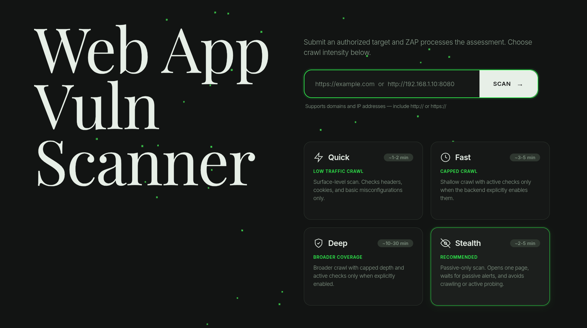

<div align="center">
  
</div>

 # BlackHawk

**BlackHawk** is a web application vulnerability scanner powered by [OWASP ZAP](https://www.zaproxy.org/). It provides a clean, real-time dashboard to spider websites, run active vulnerability scans, and inspect findings -- all from your browser.

Built with a **Rust/Actix-web** backend and a vanilla **HTML/CSS/JS** frontend, orchestrated via Docker Compose.

---

## Features

- **4 Scan Modes** -- Quick, Fast, Deep, Stealth (safe defaults with capped depth/load)
- **Real-Time Progress** -- Live spider + active scan percentage updates
- **Risk-Based Filtering** -- Filter alerts by High / Medium / Low severity
- **Stop & Retry** -- Cancel running scans, start new ones instantly
- **OWASP Top 10 Coverage** -- Scans for XSS, SQL injection, broken auth, misconfigurations, and more
- **Export Results** -- Download scan results as JSON or CSV

---

## Architecture

```
┌─────────────────┐      ┌──────────────────┐      ┌──────────────────┐
│   Browser       │────▶│  Actix-web API   │────▶│  OWASP ZAP       │
│  (Frontend)     │◀────│  (Rust Backend)  │◀────│  (Scanner Engine)│
└─────────────────┘      └──────────────────┘      └──────────────────┘
        │                        │
    index.html              main.rs
    app.js                  scanner.rs
    style.css               models.rs
                            owasp.rs
```

### Scan Modes

| Mode    | Spider Threads | Max Children | Active Scan | Request Delay | Time Cap | Description |
|---------|---------------|-------------|-------------|---------------|----------|-------------|
| Stealth | 0             | 0           | No          | —             | 2 min    | Passive only -- opens the target once and avoids crawling/probing |
| Quick   | 1             | 5           | No          | 750 ms        | 3 min    | Surface-level crawl with low request volume |
| Fast    | 1             | 10          | Opt-in      | 500 ms        | 7 min    | Shallow crawl; active checks only when explicitly enabled |
| Deep    | 2             | 50          | Opt-in      | 500 ms        | 15 min   | Broader capped crawl; active checks only when explicitly enabled |

Active scanning is disabled by default to prevent accidental load or destructive checks against a web app. Set `ZSCANNER_ENABLE_ACTIVE_SCAN=true` only for targets you own and have permission to test.

---

## Prerequisites

- [Docker](https://docs.docker.com/get-docker/) & [Docker Compose](https://docs.docker.com/compose/install/)
- Git

---

## Quick Start

### 1. Clone the Repository

```bash
git clone https://github.com/Nikku2716/BlackHawk.git
cd BlackHawk
```

### 2. Start the Services

```bash
docker compose up --build
```

This starts two containers:

| Container      | Port | Role                          |
|----------------|------|-------------------------------|
| `blackhawk-zap` | 8080 | OWASP ZAP daemon              |
| `blackhawk-api` | 8000 | Rust API server + frontend    |

Wait for the ZAP health check to pass (typically 30–60 seconds on first run).

### 3. Open the Dashboard

Visit [http://localhost:8000](http://localhost:8000)

Enter a target URL (e.g. `http://example.com`), select a scan mode, and click **Scan**.

### 4. Scanning Local / LAN Apps

BlackHawk can scan web apps running on your local machine or LAN:

| Target Type | URL Example | Notes |
|---|---|---|
| **localhost** | `http://localhost:3000` | Auto-rewritten to `host.docker.internal` |
| **127.0.0.1** | `http://127.0.0.1:8080` | Auto-rewritten to `host.docker.internal` |
| **LAN IP** | `http://192.168.1.50:3000` | Works directly — ZAP can reach LAN IPs |
| **Docker host** | `http://host.docker.internal:3000` | Explicit Docker host reference |

> **How it works:** When you enter `localhost` or `127.0.0.1`, the backend automatically rewrites it to `host.docker.internal` so ZAP (running inside Docker) can reach your host machine's services. LAN IPs (e.g. `192.168.x.x`, `10.x.x.x`) work as-is.

---

## Development (Without Docker)

### Backend

```bash
cd backend

# Make sure ZAP is running locally on port 8080
ZAP_API_URL=http://localhost:8080 cargo run
```

For development with auto-rebuild, install [cargo-watch](https://crates.io/crates/cargo-watch):

```bash
cargo install cargo-watch
ZAP_API_URL=http://localhost:8080 cargo watch -x run
```

### Frontend

The frontend is served automatically by the Actix-web backend. Static files are in `frontend/`. Edit `index.html`, `app.js`, or `style.css` and refresh.

---

## API Endpoints

| Method | Endpoint              | Description                    |
|--------|-----------------------|--------------------------------|
| GET    | `/`                   | Serves the web dashboard       |
| GET    | `/api/health`         | Health check                   |
| POST   | `/api/scan`           | Start a new scan               |
| GET    | `/api/status/{id}`    | Poll scan progress             |
| POST   | `/api/stop/{id}`      | Stop a running scan            |
| GET    | `/api/results/{id}`   | Retrieve vulnerability results |
| GET    | `/api/history`        | List all scan history          |
| GET    | `/api/export/{id}`    | Export results (JSON/CSV)      |

### Start a Scan

```bash
curl -X POST http://localhost:8000/api/scan \
  -H "Content-Type: application/json" \
  -d '{"target_url": "http://example.com", "scan_mode": "stealth"}'
```

Response:

```json
{
  "scan_id": "a1b2c3d4e5f6",
  "message": "Scan started successfully"
}
```

### Poll Status

```bash
curl http://localhost:8000/api/status/a1b2c3d4e5f6
```

### Get Results

```bash
curl http://localhost:8000/api/results/a1b2c3d4e5f6
```

### Export as CSV

```bash
curl "http://localhost:8000/api/export/a1b2c3d4e5f6?format=csv" -o results.csv
```

---

## Project Structure

```
BlackHawk/
├── docker-compose.yml          # Orchestrates ZAP + API containers
├── backend/
│   ├── Cargo.toml              # Rust dependencies
│   ├── Dockerfile              # Multi-stage Rust build
│   └── src/
│       ├── main.rs             # Actix-web application + endpoints
│       ├── scanner.rs          # ZapScanner — ZAP API wrapper
│       ├── models.rs           # Request/response types & scan state
│       └── owasp.rs            # CWE → OWASP Top 10 mapping
└── frontend/
    ├── index.html              # Single-page dashboard
    ├── app.js                  # UI logic + API polling
    └── style.css               # NewForm editorial theme
```

---

## Configuration

### Environment Variables

| Variable       | Default                | Description            |
|----------------|------------------------|------------------------|
| `ZAP_API_URL`  | `http://zap:8080`      | ZAP daemon address     |
| `ZSCANNER_ENABLE_ACTIVE_SCAN` | `false` | Enables ZAP active scans for Fast/Deep modes |
| `ZSCANNER_MAX_CONCURRENT_SCANS` | `1` | Maximum number of running scans across all targets |

### Scan Mode Config

Edit `get_scan_mode_config()` in `backend/src/models.rs` to tune spider depth, request delay, time caps, active scan strength, and false-positive filtering. Alerts below Medium confidence are filtered out by default.

---

## License

[GNU GPLv3](LICENSE)
